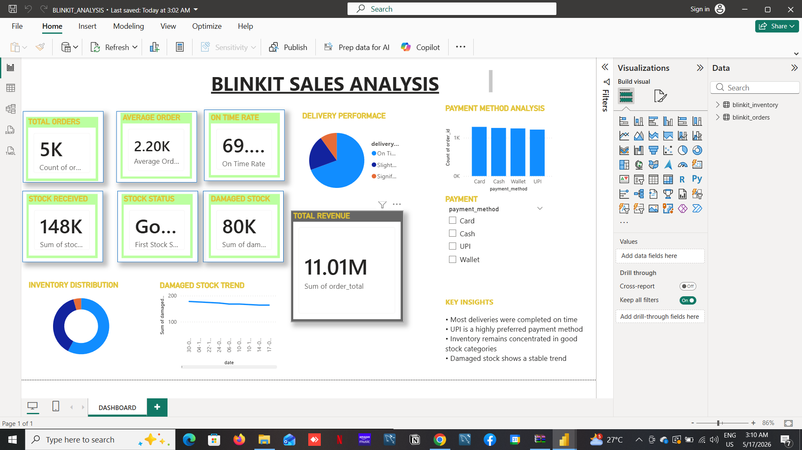

# Blinkit Sales Analysis Dashboard

## Overview
This Power BI dashboard analyzes Blinkit sales, inventory, delivery performance, and payment trends.

## Features
- Total Revenue Analysis
- Delivery Performance Tracking
- Payment Method Insights
- Inventory Distribution
- Damaged Stock Trend Analysis
- KPI Monitoring

## Tools Used
- Power BI
- Business Analytics
- Data Visualization
- CSV Datasets

## Dashboard Preview

## Files Included
- BLINKIT_ANALYSIS.pbix
- blinkit_orders.csv
- blinkit_inventory.csv

## Author
Srishti Kaur
